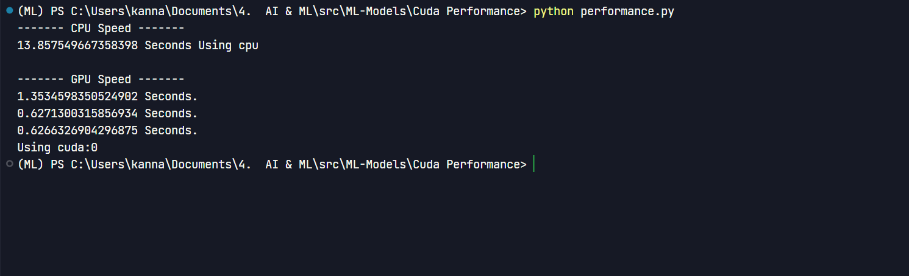

# Parallel Computing Using CUDA GPU

**This is an experiment to find out the speed difference between the serial and parallel ways of performing matxtix multiplication. The serial way is to use the CPU for Computation and the parallel way is to use the GPU for computation. For uniformity I am using Pytorch for both the computations. [Here](./performance.py) is the link of the code. We will be usign Cuda for parallel computation.**

## The machines I am using have following specs

| CPU | GPU |
| --- | --- |
| Ryzen 5 3500H | GTX 1650 |

- The [Test](./Cuda_Pytorch_test.py) file is used to verify whether Cuda is working or not in the system.

- The matrix we are using to test the performance would have 32 rows and 250 columns.

## Results

```python
CPU Computing time  = 13.857549 seconds
GPU Computing time  = 0.6266326 seconds

```



_As the complexity of the computation increases, GPU perfroms way better than the CPU._
